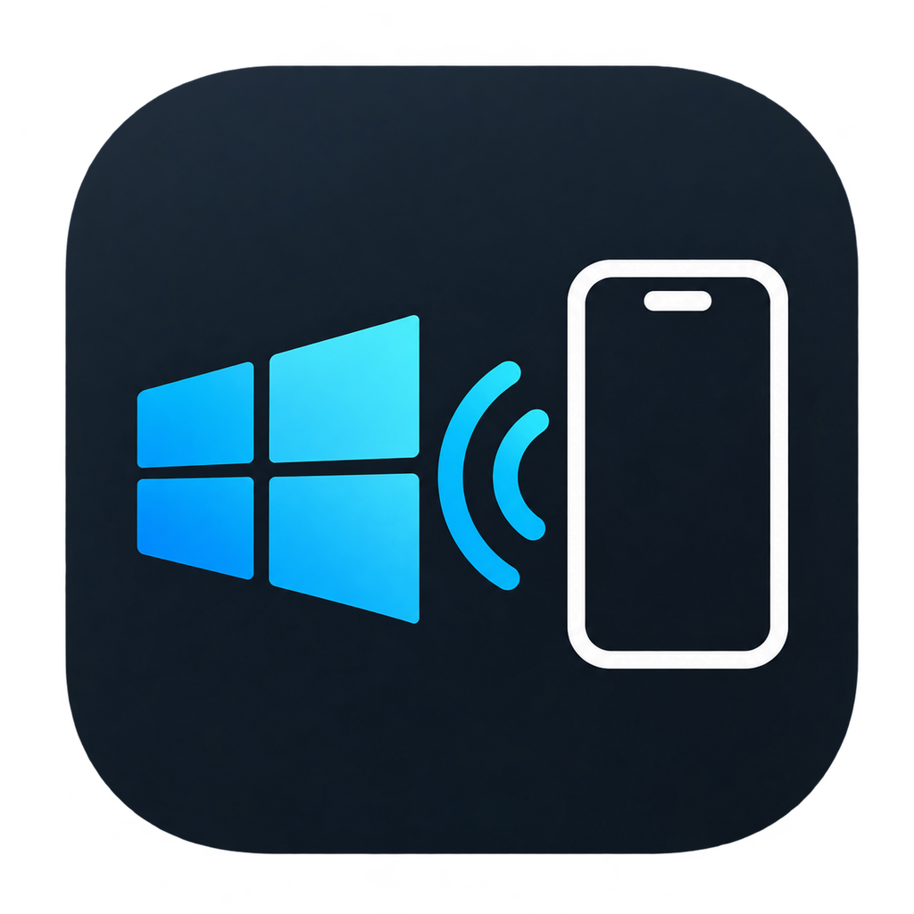

# iPhone Companion

**v1.2** · Windows · Python 3.11+ · PySide6

Mirrors iPhone notifications, calls and media to a Windows desktop over
Bluetooth LE. No app on the phone, no cloud account, no MFi hardware — just
the services iOS already exposes to a bonded Bluetooth peer.



- **Notifications** — every app, with real artwork, and the action labels iOS
  itself advertises ("Answer", "Decline", "Dial", "End Call")
- **Calls** — Apple-style banner with a live duration counter, answer and
  decline from the desktop, dial back from a missed call, plus call history
- **Media** — now playing, transport, volume, album art, synced lyrics
- **Battery** — live level with notifications, and a session history chart
- **Dashboard** — a Qt window that collects all of it, or stay out of the way
  in the system tray

## How it works

Three services on the phone do the work:

| Service | UUID | What it gives us |
|---|---|---|
| ANCS | `7905F431-…` | notifications, attributes, action labels, perform-action |
| AMS | `89D3502B-…` | player, track, elapsed, volume, remote commands |
| Battery | `0x180F` | level, with notify |

`probe.py` dumps the full GATT database and logs raw ANCS/AMS traffic — it is
how every protocol detail here was established rather than guessed.

## Why this is not Phone Link

The obvious question: Phone Link shows contacts, dials numbers and carries
call audio with no app on the phone either. It does that over **Bluetooth
Classic profiles**, not BLE:

| Profile | Gives | Why we cannot use it |
|---|---|---|
| HFP (Hands-Free) | call audio, dial, answer, hang up, DTMF, mute | Classic/RFCOMM, and Windows itself owns the audio-gateway role |
| PBAP (Phone Book Access) | contacts, recent calls | Classic; no GATT equivalent |
| MAP (Message Access) | reading **and sending** SMS | Classic; why Phone Link can reply and this cannot |

`bleak` wraps `Windows.Devices.Bluetooth.GenericAttributeProfile` — GATT only.
The useful Classic profiles are claimed by the Windows Bluetooth stack, and a
profile takes one client at a time. That is also why the two apps fight over
the phone: both want to be the connected peer.

It cuts the other way too. Phone Link cannot do what this does — per-app
notification artwork, AMS media state, and iOS's own localised action labels
are all GATT. **Phone Link is the telephony client; this is the notification
client.** Complementary, unfortunately mutually exclusive.

### What is not possible

- **Call duration** is not transmitted. It is derived from the Active Call
  notification appearing and being removed, which matches a stopwatch to well
  under a second.
- **Mute state** is not exposed anywhere — not even in HFP's indicator set.
- **Locking the phone** cannot be done. Remote lock is a Find My / MDM
  function, through Apple's cloud or iAP2 with an MFi chip.
- **Sending a reply** is not possible. ANCS is read-only.
- **Call audio** stays on the phone.
- **Lyrics** do not come from Spotify — there is no public lyrics endpoint.
  They come from [LRCLIB](https://lrclib.net), free and key-less.

## Requirements

- Windows 10/11, built-in or USB Bluetooth LE
- Python 3.11+ (developed on 3.14)
- An iPhone **bonded once** through Windows Bluetooth settings

## Setup

Follow these in order. Step 2 must happen **before** the first run — the app
cannot see the notification service on a phone Windows has not bonded with,
and a failed first attempt gets cached (see the note at the end of step 2).

### 1. Install Python

Python **3.11 or newer**, from [python.org](https://www.python.org/downloads/).
Tick **"Add python.exe to PATH"** in the installer.

Prefer the python.org build over the Microsoft Store one, which sandboxes
file writes and can put `%LOCALAPPDATA%` somewhere the app does not expect.

Check it worked — open a **new** terminal (PATH changes need one) and run:

```bat
python --version
```

You should see `Python 3.11.x` or higher. If you get "Python was not found",
PATH was not set; re-run the installer and tick the box.

### 2. Bond the iPhone to Windows

ANCS characteristics require an encrypted link, and iOS will not even list
the service to an unbonded peer — which surfaces as "characteristic not
found" rather than as a permission error.

1. iPhone → Settings → Bluetooth → (i) next to the PC → **Forget This Device**
2. Windows → Settings → Bluetooth & devices → remove any existing iPhone entry
3. Windows → **Add device** → **Bluetooth** → pick the iPhone
4. Confirm the pairing code on **both** screens
5. On the iPhone, when it asks, **Allow** notifications to be shared

Steps 1–2 are cache invalidation, not superstition. Windows caches a device's
GATT service list, and an empty ANCS list from an unbonded attempt survives a
later successful bond — so a phone that was paired before you read this needs
forgetting and re-pairing.

### 3. Disable Phone Link autostart

Task Manager → **Startup apps** → **Phone Link** → Disable. Then quit it if
it is running.

This matters more than it looks. A Bluetooth profile serves one client at a
time, and Phone Link holds the link. It is the single most common cause of a
connection that will not hold. See "Why this is not Phone Link" above for why
the two cannot coexist.

### 4. Get the code

```bat
git clone https://github.com/<you>/iphone-companion.git
cd iphone-companion
```

No git? Download the ZIP from GitHub and extract it, then `cd` into it.

### 5. Create a virtual environment

```bat
python -m venv .venv
```

Activate it. **The command differs by terminal:**

```bat
.venv\Scripts\activate.bat
```

```powershell
.venv\Scripts\Activate.ps1
```

If PowerShell refuses with *"running scripts is disabled on this system"*,
either use Command Prompt instead, or allow local scripts once:

```powershell
Set-ExecutionPolicy -Scope CurrentUser -ExecutionPolicy RemoteSigned
```

Your prompt should now start with `(.venv)`.

### 6. Install the dependencies

```bat
python -m pip install --upgrade pip
python -m pip install -r requirements.txt
```

Use `python -m pip`, not a bare `pip`. On Windows the two frequently resolve
to different interpreters, which is how packages end up installed somewhere
the app cannot import them from.

This pulls PySide6 (~100 MB), bleak, Pillow, pystray and windows-toasts.

### 7. Run it

```bat
python qt_main.py
```

The dashboard opens and the tray icon appears. The sidebar footer shows
**Connected** with the phone's name once the link is up; the first connection
can take up to a minute while Windows resolves the rotating BLE address.

### 8. Check it works without the phone

Right-click the tray icon → **Simulate** → **All toasts**. Every banner
variant appears — incoming call, missed call, message, OTP message and a
bank alert. This exercises the UI end to end and needs no phone at all, so
it is the fastest way to confirm the install is sound.

You can also verify the one-time-code detector on its own:

```bat
python otp.py
```

It should print `23/23 passed`.

### Troubleshooting

| Symptom | Cause and fix |
|---|---|
| `Python was not found` | PATH not set. Re-run the python.org installer with "Add python.exe to PATH", then open a new terminal. |
| `running scripts is disabled on this system` | PowerShell execution policy. Use `activate.bat` in Command Prompt, or run the `Set-ExecutionPolicy` line in step 5. |
| `ModuleNotFoundError: No module named 'PySide6'` | The venv is not active, or packages went to a different interpreter. Re-activate and reinstall with `python -m pip`. |
| Connects, then drops within seconds | Phone Link. Disable its autostart and quit it (step 3). |
| "characteristic not found", or no notifications ever arrive | The phone is not bonded, or a pre-bond service list is cached. Redo step 2 in full, including the Forget on both sides. |
| Connects but no notifications from one app | iOS mirrors Notification Centre. If the app is set to Deliver Quietly or is off in Settings → Notifications, nothing is sent. |
| Window opens blank or the tray icon is missing | Another instance is already running. Quit it from the tray first. |
| No Bluetooth adapter found | The PC needs Bluetooth **LE** (4.0+). Check Device Manager → Bluetooth. A USB BLE dongle works. |

Set `ANCS_DEBUG=1` before running for verbose protocol logs — `set ANCS_DEBUG=1`
in Command Prompt, `$env:ANCS_DEBUG=1` in PowerShell. The log also goes to
`ancs_notifier.log` beside the scripts.

### Optional: replace the icon

The repo ships `assets/app_icon.png` and `assets/app.ico`, so **you do not
need this to run the app**. Only if you want your own artwork:

```bat
python make_icon.py "path\to\your-icon.png"
```

## Running

```bat
python qt_main.py             console visible, for debugging
pythonw qt_main.py            no console
python app_ble.py             headless, Tkinter banners only
python probe.py --listen 180  protocol reconnaissance
```

Quit from the tray, `Ctrl+Q` in the window, or `Ctrl+C` in the console.
`set ANCS_DEBUG=1` (cmd) or `$env:ANCS_DEBUG=1` (PowerShell) for verbose logs.

The tray's **Simulate** submenu raises any toast variant — incoming call,
missed call, message, OTP message, bank alert, or all of them — without
touching the phone.

## Optional: Spotify

AMS gives no album art and no absolute volume. Spotify's Web API gives both.

1. Create an app at [developer.spotify.com/dashboard](https://developer.spotify.com/dashboard)
2. Add `http://127.0.0.1:8899/callback` as a redirect URI
3. Paste the Client ID into Settings → Spotify → Connect

Auth is Authorization Code with **PKCE**, so no client secret is stored — only
a refresh token, in `%LOCALAPPDATA%\ANCSNotifier\spotify.json`. Absolute volume
requires Spotify Premium; the API returns 403 otherwise.

## Building

```bat
python -m pip install pyinstaller
python build.py --installer
```

Produces `dist\iPhoneCompanion\` and, with
[Inno Setup 6](https://jrsoftware.org/isdl.php), a per-user setup exe in
`dist\installer\`. No admin rights needed — Bluetooth does not require
elevation. Expect SmartScreen to flag an unsigned binary on first run.

## Layout

| File | Role |
|---|---|
| `ancs.py` | ANCS protocol: packets, attributes, actions, reassembly |
| `ams.py` | Apple Media Service: now playing and remote commands |
| `app_ble.py` | connect, subscribe, stay connected |
| `calls.py` | reconstructs call state and duration from ANCS events |
| `qt_main.py` | entry point: tray, threads, signal bridging |
| `dashboard.py` | the window and its seven pages |
| `qt_toast.py` | desktop toasts — four variants, one component |
| `otp.py` | finds a one-time code in a notification, for the Copy pill |
| `theme.py` | palette, plus the toast QSS and its scale factors |
| `widgets.py` `vicons.py` | dashboard building blocks, vector icons |
| `store.py` `status.py` `applog.py` `prefs.py` | shared state, logging, settings |
| `spotify.py` `lyrics.py` | optional artwork, volume and lyrics |
| `icons.py` `appicon.py` | app artwork, and the tray/application icon |
| `startup.py` `shortcuts.py` | run-at-login, and the actions that work |
| `simulate.py` | fake phone events for testing the UI |
| `probe.py` | GATT dump and raw traffic log |
| `build.py` `installer.iss` | packaging |
| `make_icon.py` | regenerates the icon assets — not needed to run or build |

`macos_toast.py` and `tray_app.py` are the superseded Tkinter/pystray
implementation, kept as a fallback for running `app_ble.py` bare.

## Runtime data

Everything writable lives in `%LOCALAPPDATA%\ANCSNotifier\` when frozen, or
beside the scripts from source: `config.json` (cached address), `spotify.json`
(refresh token — **not** for committing), `prefs.json`, `lyrics.json`,
`icon_cache\`, `art\`, `ancs_notifier.log`.

## Notes for anyone extending this

- Action-label attributes (`6`, `7`), `AppIdentifier` and `Date` take **no**
  length parameter. Appending one makes iOS read the length bytes as two more
  attribute requests and corrupts the whole response.
- Control Point writes must be **sequential**. Concurrent writes get dropped —
  that is what made the volume slider look dead.
- Answered vs missed is detectable because Incoming-Call-removed and
  Active-Call-added arrive in the same millisecond.
- iPhones rotate their BLE address; the cached one self-heals after three
  consecutive failures.
- Qt cannot round a translucent top-level window's corners, so every toast is
  a transparent window wrapping a styled child `QFrame`.
- `QGraphicsDropShadowEffect` on a child of such a window can render blank —
  see `USE_SHADOW` in `qt_toast.py`.

## License

MIT — see [LICENSE](LICENSE).

Not affiliated with or endorsed by Apple. ANCS and AMS are Apple
specifications; this is an independent client for them.
